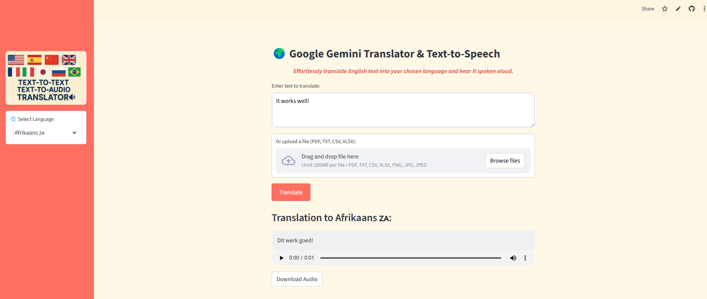

# 🌍🔊Translate and Speak : Multilingual for English Input
***Built with Streamlit, Gemini API, gTTS and OCR file support.***

[🚀 Live Demo (Click Here!)](https://translate-and-speak-khsxqerqw2gb6puy9rizxe.streamlit.app/)

Translate English text into dozens of languages and hear it spoken aloud — all in one smooth, easy-to-use web app with audio download included.

Simply input your English text (or upload a file!), choose your target language, and receive both the translated text and a downloadable audio file.


## 🧭Getting Started

Follow these steps to set up and run the application in you local machine

### 1. 📝Prerequisites
* Python 3.10
* Python package installer `pip`
* **Poppler Utilities** required for PDF processing.
    *   **macOS (Homebrew):** `brew install poppler`
    *   **Linux (apt-get):** `sudo apt-get install poppler-utils`
    *   **Windows:** Download from [here](https://poppler.freedesktop.org/) Ensure it's added to your PATH.


### 2. 🧬Clone the repository

Clone to your local machine in your desired project folder:
```bash
git clone https://github.com/mcadriaans/translate-and-speak.git
```

### 3. ⚙️Set Up a Virtual Environment
It's best practice to use a virtual environment.

<b>For Windows (Powershell)</b>
```bash
python -m venv venv
.\venv\Scripts\Activate.ps1
```
(If you encounter script execution issues, you might need to run:
```bash
Set-ExecutionPolicy RemoteSigned -Scope CurrentUser
```

<b>For macOS/Linux</b>
```bash
python3 -m venv venv
source venv/bin/activate
```

### 4. 📦Install Dependencies
Install all neccessary Python packages:
```bash
pip install -r requirements.txt
```
❗Note: EasyOCR models (craft_mlt_25k.pth, english_g2.pth) are included in the ml_models/easyocr directory. Ensure these are present for OCR functionality.

### 5. 🔑Configure Your Gemini API Key
This application requires a Google Gemini API key.
1. Generate a key from [Google AI Studio](https://aistudio.google.com/prompts/new_chat)
2. Create a file named <b>`.env`</b> in the root of your project directory.
3. Add your API key to this file:
```python
GOOGLE_API_KEY = your_api_key_here
```
Replace your_api_key_here with you actual key.

### 6. 🚀Launch the Application
Activate the virtual enviroment, configure the API key and then run the application:
```bash
python -m streamlit run translator_app.py
```
Your default web browser will open the application, ready for use.

## 🧱Technology Stack
| Category                    | Tools Used                                         |
| :------------------------   | :------------------------------------------------- |
| **Web Framework**           | `streamlit`                                        |
| **AI/Translation**          | `google.generativeai` (Gemini 1.5 Flash)           |
| **Text-to-Speech**          | `gTTS` (Google Text-to-Speech)                     |
| **OCR(Image Parsing)**      | `easyOCR`, `pdf2image`, `PIL`, `numpy`             |                 
| **File Handling**           |`io`, `tempfile`, `os`, `openpyxl`, `pandas`        |
| **Environment Management**  | `python-dotenv`                                    |
| **Language Detection**      | `langdetect`                                       |
| **Custom Utilties**         | `extract_text_from_file` (from `utils.file_parser`)|

## 📄Detailed Documentation
For a comprehensive understanding of the project's design, architectural decisions, testing methodology, detailed feature explanations etc., refer to the documentation.pdf file in this repository.

## 📁Project Structure 
```
translate-and-speak/                 # Root directory of the Translate & Speak application
├── assets/                          # Folder for static resources used by the app
    └── images   
│   └── sample_files/                # Contains example input files for testing OCR and translation (PDFs, DOCX, TXT)
├── ml_models/                       # Stores machine learning models used by the app
│   └── easyocr/                     # EasyOCR-specific model files for text detection and recognition
        └── craft_mlt_25k.pth        # Pretrained model for detecting text regions in images (CRAFT model)
        └── english_g2.pth           # Pretrained model for recognizing English characters (G2 model)
├── utils/                           # Utility scripts and helper functions to support core app logic
│   └── file_parser.py               # Handles file parsing and text extraction from uploaded documents
├── .gitignore                       # Tells Git which files/folders to ignore (e.g., .env, venv)
├── README.md                        # Main documentation file: explains what the app does and how to use it
├── packages.txt                     # Optional list of system-level packages needed for deployment platform
├── requirements.txt                 # Lists all Python libraries required to run the app (used for pip install)
├── runtime.txt                      # Specifies the Python version for deployment platform
├── translation_speak_app.py         # The main Streamlit app script: manages UI, file upload, OCR, translation, and speech
└── documentation.pdf                # Formal project documentation
```
## ⚠️Important Considerations and Limitations
* **Input Language**: Currently, the application processes **English text only** for translation. This was a deliberate design choice for complexity management and consistent quality.
* **gTTS Language Support**: gTTS has a limited set of supported languages for speech synthesis.
* **File Size**: Maximum upload size is 200MB.
* **No Reak-Time Preview**: Translation and audio generation automatically occurs after text is submitted.
* **No GPU Support**: If deploying on Streamlit Commutity Cloud. This can lead to slower inference times as computational demands grow with more complex/larger tasks.


## 🤝Contributing
Contributions are welcome! If you have suggestions, bug reports, or want to contribute code, please feel free to open an issue or submit a pull request.

🙋‍♀️ Author: Created with 💜 by Michéle

## 📜License
This project is licensed under the MIT License.
